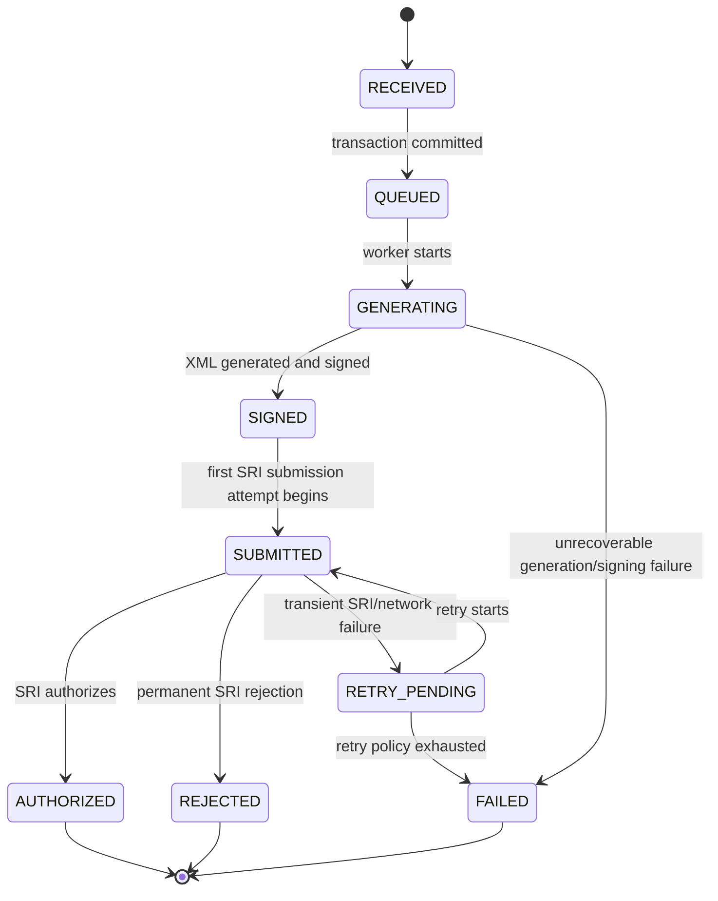

# Fiscal Document Lifecycle

This document defines the initial processing lifecycle for fiscal documents in Emitta.

The lifecycle is a domain contract, not merely a Java enum.

Its purpose is to:

- prevent impossible transitions;
- provide auditability;
- support asynchronous processing;
- distinguish retryable failures from terminal fiscal outcomes;
- provide measurable timestamps for the immediate-transmission SLO;
- make API responses and webhooks unambiguous.

## Initial state machine



## State semantics

### `RECEIVED`

The API has accepted a valid request and created the fiscal document inside the current database transaction.

Expected data already available:

- tenant
- taxpayer
- point of issue
- document type
- idempotency key
- immutable request data required for processing

A document must not remain in `RECEIVED` after the transaction has committed successfully.

### `QUEUED`

The business transaction committed and processing intent exists durably.

In the Transactional Outbox design, this means an Outbox event exists and the document is awaiting or entering asynchronous processing.

Important:

> `QUEUED` does not mean intentionally delayed.

Under normal conditions, queue waiting time should be near zero.

### `GENERATING`

A fiscal worker owns the current processing attempt and is generating the SRI representation.

Typical work:

- allocate/confirm fiscal sequence if not already allocated
- generate access key
- construct XML
- validate required fiscal data
- prepare/sign the document

Whether sequence allocation occurs before `QUEUED` or at `GENERATING` must be finalized before implementation. The critical rule is that allocation must be atomic and idempotent.

### `SIGNED`

The fiscal XML has been generated and successfully signed with the taxpayer certificate.

At this point:

- the exact signed XML must be immutable for the attempt;
- its integrity/fingerprint may be recorded;
- it is ready for SRI submission.

### `SUBMITTED`

Emitta has initiated a submission/authorization interaction with the SRI.

This state does not necessarily mean the SRI has authorized the document.

It represents an active or completed submission attempt awaiting classification.

### `RETRY_PENDING`

A temporary failure prevented completion, but retry is allowed.

Examples:

- network timeout
- temporary SRI unavailability
- retryable upstream transport error

The retry policy must be bounded.

No document may remain in an infinite retry loop.

### `AUTHORIZED`

Terminal success state.

The SRI authorized the document.

Expected persisted information may include:

- authorization identifier
- authorization timestamp
- access key
- SRI response metadata
- authorized XML / response
- immutable fiscal identifiers

No normal transition may leave `AUTHORIZED`.

### `REJECTED`

Terminal fiscal rejection.

Use this when the upstream authority rejects the document for a permanent fiscal/validation reason that cannot be solved by retrying the same payload.

The SRI response must be preserved.

A corrected business document should normally be represented by a new valid operation rather than mutating the rejected historical attempt invisibly.

### `FAILED`

Terminal technical failure after Emitta determines that processing cannot continue automatically.

Examples:

- certificate unusable
- XML generation bug
- unrecoverable internal invariant violation
- retry policy exhausted

`FAILED` is different from `REJECTED`:

```text
REJECTED = fiscal/upstream permanent outcome
FAILED   = Emitta/technical processing terminal outcome
```

## Allowed transitions

Initial transition matrix:

| From | To | Allowed | Meaning |
|---|---|---:|---|
| `RECEIVED` | `QUEUED` | Yes | Processing intent persisted |
| `RECEIVED` | `FAILED` | No* | Prefer transaction rollback before durable creation |
| `QUEUED` | `GENERATING` | Yes | Worker starts |
| `GENERATING` | `SIGNED` | Yes | XML/signature complete |
| `GENERATING` | `FAILED` | Yes | Terminal generation/signature failure |
| `SIGNED` | `SUBMITTED` | Yes | SRI attempt starts |
| `SUBMITTED` | `AUTHORIZED` | Yes | Successful authorization |
| `SUBMITTED` | `REJECTED` | Yes | Permanent fiscal rejection |
| `SUBMITTED` | `RETRY_PENDING` | Yes | Transient failure |
| `RETRY_PENDING` | `SUBMITTED` | Yes | Retry begins |
| `RETRY_PENDING` | `FAILED` | Yes | Retry policy exhausted |
| `AUTHORIZED` | any | No | Terminal |
| `REJECTED` | any | No | Terminal |
| `FAILED` | any | No | Terminal in the initial model |

`*` If the transaction that creates the document fails before commit, no durable document should exist. This is preferable to persisting an immediately failed record for validation errors that should have prevented acceptance.

## API semantics

### Create invoice

Target endpoint:

```text
POST /api/v1/invoices
```

A successfully accepted asynchronous request should return:

```text
202 Accepted
```

Example response:

```json
{
  "id": "019...",
  "status": "QUEUED"
}
```

Important:

```text
202 Accepted != SRI authorized
```

The OpenAPI description must state this explicitly.

### Get status

Target endpoint:

```text
GET /api/v1/invoices/{id}
```

Example:

```json
{
  "id": "019...",
  "status": "AUTHORIZED",
  "accessKey": "...",
  "authorizedAt": "2026-10-04T20:21:52-05:00"
}
```

## Status history

Every durable state transition should create a `DocumentStatusHistory` record.

Example:

```text
RECEIVED -> QUEUED
QUEUED -> GENERATING
GENERATING -> SIGNED
SIGNED -> SUBMITTED
SUBMITTED -> AUTHORIZED
```

A history record should capture:

```text
document_id
from_status
to_status
reason
metadata
created_at
```

The current status remains on `documents.status` for efficient queries.

History is append-only.

## Processing attempts

Technical attempts are recorded separately from state history.

Example:

```text
Document 123

Attempt 1:
operation = SRI_SUBMISSION
result    = TIMEOUT

Attempt 2:
operation = SRI_SUBMISSION
result    = SUCCESS
```

Recommended operations may include:

```text
XML_GENERATION
SIGNATURE
SRI_SUBMISSION
SRI_AUTHORIZATION_QUERY
WEBHOOK_DELIVERY
```

Not all operations need to be persisted initially. Persist attempts where operational/audit value justifies them.

## Timing fields

The document should capture important lifecycle timestamps.

Initial direction:

```text
received_at
queued_at
processing_started_at
signed_at
submitted_at
authorized_at
failed_at
```

Not every state must require a dedicated database column.

Use dedicated columns only for timestamps that are:

- queried frequently;
- needed for SLOs;
- operationally significant.

Full chronology is available through `DocumentStatusHistory`.

## Immediate-transmission SLO

ADR-014 defines initial engineering targets:

```text
API acknowledgement p95:              < 500 ms
Request -> durable outbox commit:      < 500 ms
Normal queue waiting time:             < 250 ms
Request -> first SRI attempt p95:      < 2 s
Sustained-load API error rate:         < 1%
Normal queue backlog:                  ~ 0
```

These are engineering objectives, not SRI legal deadlines.

The lifecycle must provide enough timestamps and metrics to measure them.

## Retry policy principles

Retries must only be used for transient failures.

Do not retry indefinitely.

Conceptual policy:

```text
attempt 1
   |
temporary failure
   v
backoff
   |
attempt 2
   |
temporary failure
   v
backoff
   |
attempt N
   |
   +--> success
   |
   +--> FAILED / DLQ
```

Exact retry counts/backoff values belong to infrastructure configuration and should be tuned using test evidence.

## Circuit Breaker behavior

The SRI adapter may reject immediate calls while the circuit is open.

This must not lose processing intent.

Expected behavior:

```text
Document ready for submission
        |
Circuit OPEN
        |
RETRY_PENDING
        |
future retry after recovery
```

Circuit Breaker is implemented at the SRI infrastructure boundary, not in controllers.

## Idempotency behavior

A duplicate API request using the same:

```text
tenant_id + idempotency_key
```

must resolve to the same original fiscal operation rather than creating a second invoice.

Conceptually:

```text
POST invoice
Idempotency-Key: sale-123
        |
        v
created document A

POST same request
Idempotency-Key: sale-123
        |
        v
return document A / equivalent idempotent response
```

A request that reuses an existing idempotency key with materially different payload should be rejected as an idempotency conflict.

## Worker idempotency

RabbitMQ may deliver a message more than once.

Therefore:

```text
duplicate delivery != duplicate fiscal issuance
```

Before executing irreversible fiscal actions, workers must inspect durable document state and attempt identity.

The exact consumer-idempotency mechanism will be designed in the messaging feature.

## Webhook lifecycle

Webhook delivery is not part of the fiscal state machine.

An authorized invoice remains `AUTHORIZED` even if webhook delivery fails.

Webhook delivery has its own retry lifecycle.

Do not model:

```text
AUTHORIZED -> FAILED
```

because a webhook could not be delivered.

Fiscal state and notification state are separate concerns.

## Recovery and manual intervention

The initial MVP does not define manual state overrides.

Administrative repair tools must not directly mutate states without audit.

If manual recovery is later required, it should use explicit commands such as:

```text
retry document
requeue document
rotate certificate
redeliver webhook
```

rather than direct SQL status updates.

Any operation that changes fiscal behavior after a terminal state requires explicit design and audit rules.

## Terminal states

Initial terminal states:

```text
AUTHORIZED
REJECTED
FAILED
```

Their semantics are intentionally distinct.

### `AUTHORIZED`

Fiscal success.

### `REJECTED`

Permanent fiscal rejection from the authority or validation flow.

### `FAILED`

Technical processing failure that cannot be automatically recovered.

## Future document types

The same shared lifecycle should be reusable for:

```text
INVOICE
CREDIT_NOTE
DEBIT_NOTE
WITHHOLDING
DISPATCH_GUIDE
```

If a future document type requires a materially different lifecycle, use document-type-specific policy/strategy rather than filling the shared state machine with special-case transitions.

## Implementation direction

The implementation should provide a single transition policy instead of allowing arbitrary:

```java
document.setStatus(anyStatus);
```

A future domain method may look conceptually like:

```java
document.queue();
document.startGeneration();
document.markSigned();
document.markSubmitted();
document.authorize(...);
document.reject(...);
document.scheduleRetry(...);
document.fail(...);
```

Each method enforces valid current state.

Do not expose a public unrestricted status setter.

## Open questions before implementation

- At what exact transaction boundary is the fiscal sequence allocated?
- Is `RECEIVED` externally observable or purely internal?
- Do XML/signature failures always become `FAILED`, or can some be repairable?
- Is SRI receipt/authorization one operation or two explicit states?
- What SRI response data must be persisted verbatim?
- What retention period applies to attempts and status history?
