# Emitta ERD — Initial Domain Model

This document defines the initial relational model for Emitta before implementation in Flyway and JPA.

The diagram is intentionally broader than the invoice MVP so that the shared fiscal foundation is explicit.

## Entity Relationship Diagram

```mermaid
erDiagram

    PROVIDER_IDENTITY {
        uuid id PK
        varchar provider_ruc UK
        varchar legal_name
        varchar establishment_code
        varchar economic_activity
        varchar regulatory_status
        timestamptz created_at
        timestamptz updated_at
    }

    TENANT {
        uuid id PK
        varchar name
        varchar status
        timestamptz created_at
        timestamptz updated_at
    }

    API_CLIENT {
        uuid id PK
        uuid tenant_id FK
        varchar client_id UK
        varchar client_secret_hash
        varchar name
        varchar status
        timestamptz created_at
        timestamptz last_used_at
        timestamptz rotated_at
    }

    TAXPAYER {
        uuid id PK
        uuid tenant_id FK
        varchar ruc
        varchar legal_name
        varchar trade_name
        varchar status
        boolean test_enabled
        boolean production_enabled
        timestamptz created_at
        timestamptz updated_at
    }

    ESTABLISHMENT {
        uuid id PK
        uuid taxpayer_id FK
        char code
        varchar name
        varchar address
        varchar status
        timestamptz created_at
        timestamptz updated_at
    }

    POINT_OF_ISSUE {
        uuid id PK
        uuid establishment_id FK
        char code
        varchar name
        varchar status
        timestamptz created_at
        timestamptz updated_at
    }

    DOCUMENT_SEQUENCE {
        uuid id PK
        uuid point_of_issue_id FK
        varchar document_type
        varchar environment
        bigint current_value
        timestamptz updated_at
    }

    CERTIFICATE {
        uuid id PK
        uuid taxpayer_id FK
        varchar alias
        varchar fingerprint
        varchar subject
        varchar issuer
        timestamptz valid_from
        timestamptz valid_until
        varchar status
        bytea encrypted_content
        bytea encrypted_password
        timestamptz created_at
        timestamptz updated_at
    }

    CUSTOMER {
        uuid id PK
        uuid tenant_id FK
        varchar identification_type
        varchar identification
        varchar name
        varchar email
        varchar address
        varchar status
        timestamptz created_at
        timestamptz updated_at
    }

    WEBHOOK_ENDPOINT {
        uuid id PK
        uuid tenant_id FK
        varchar url
        varchar status
        bytea encrypted_secret
        timestamptz created_at
        timestamptz updated_at
    }

    DOCUMENT {
        uuid id PK
        uuid tenant_id FK
        uuid taxpayer_id FK
        uuid point_of_issue_id FK
        varchar document_type
        varchar environment
        bigint sequential
        varchar access_key UK
        varchar status
        varchar idempotency_key
        timestamptz issued_at
        timestamptz received_at
        timestamptz queued_at
        timestamptz processing_started_at
        timestamptz signed_at
        timestamptz submitted_at
        timestamptz authorized_at
        timestamptz failed_at
        timestamptz created_at
        timestamptz updated_at
    }

    INVOICE {
        uuid document_id PK,FK
        uuid customer_id FK
        varchar buyer_identification_type
        varchar buyer_identification
        varchar buyer_name
        varchar buyer_email
        varchar buyer_address
        numeric subtotal
        numeric discount_total
        numeric tax_total
        numeric total
        varchar currency
    }

    INVOICE_ITEM {
        uuid id PK
        uuid invoice_id FK
        integer line_number
        varchar sku
        varchar description
        numeric quantity
        numeric unit_price
        numeric discount
        numeric subtotal
        numeric tax_total
        numeric total
    }

    INVOICE_ITEM_TAX {
        uuid id PK
        uuid invoice_item_id FK
        varchar tax_code
        varchar percentage_code
        numeric rate
        numeric taxable_base
        numeric tax_amount
    }

    DOCUMENT_STATUS_HISTORY {
        uuid id PK
        uuid document_id FK
        varchar from_status
        varchar to_status
        varchar reason
        jsonb metadata
        timestamptz created_at
    }

    DOCUMENT_ATTEMPT {
        uuid id PK
        uuid document_id FK
        integer attempt_number
        varchar operation
        varchar result
        varchar error_code
        varchar error_message
        jsonb response_payload
        timestamptz started_at
        timestamptz finished_at
        timestamptz created_at
    }

    OUTBOX_EVENT {
        uuid id PK
        uuid tenant_id FK
        varchar aggregate_type
        uuid aggregate_id
        varchar event_type
        jsonb payload
        integer attempts
        timestamptz created_at
        timestamptz published_at
    }

    TENANT ||--o{ API_CLIENT : owns
    TENANT ||--o{ TAXPAYER : owns
    TENANT ||--o{ CUSTOMER : owns
    TENANT ||--o{ WEBHOOK_ENDPOINT : configures
    TENANT ||--o{ DOCUMENT : owns
    TENANT ||--o{ OUTBOX_EVENT : produces

    TAXPAYER ||--o{ ESTABLISHMENT : has
    TAXPAYER ||--o{ CERTIFICATE : owns
    TAXPAYER ||--o{ DOCUMENT : issues

    ESTABLISHMENT ||--o{ POINT_OF_ISSUE : contains
    POINT_OF_ISSUE ||--o{ DOCUMENT_SEQUENCE : allocates
    POINT_OF_ISSUE ||--o{ DOCUMENT : emits

    DOCUMENT ||--o| INVOICE : specializes
    CUSTOMER o|--o{ INVOICE : referenced_by

    INVOICE ||--|{ INVOICE_ITEM : contains
    INVOICE_ITEM ||--o{ INVOICE_ITEM_TAX : has

    DOCUMENT ||--o{ DOCUMENT_STATUS_HISTORY : records
    DOCUMENT ||--o{ DOCUMENT_ATTEMPT : executes
```



## Aggregate ownership

### Tenant aggregate boundary

`Tenant` is the commercial/account boundary.

It owns configuration that controls who can use Emitta:

```text
Tenant
├── ApiClient
├── Customer
├── WebhookEndpoint
└── Taxpayer
```

Deleting tenants must not be implemented as a simple cascading delete in production. Fiscal/audit retention requirements mean deactivation or archival will usually be safer than physical deletion.

### Taxpayer fiscal boundary

`Taxpayer` is the fiscal issuer boundary.

```text
Taxpayer
├── Certificate
├── Establishment
│   └── PointOfIssue
│       └── DocumentSequence
└── Document
```

### Document aggregate

`Document` is the processing/audit root for a fiscal document.

For invoices:

```text
Document
└── Invoice
    └── InvoiceItem
        └── InvoiceItemTax
```

`DocumentStatusHistory` and `DocumentAttempt` are operational/audit records associated with the document.

## Key constraints

The SQL migration should enforce at least the following rules.

### Tenant / API clients

```text
api_clients.client_id UNIQUE
```

`client_secret` must never be persisted directly.

Persist:

```text
client_secret_hash
```

### Taxpayer

Recommended uniqueness:

```text
UNIQUE (tenant_id, ruc)
```

Whether the same RUC may belong to multiple tenants is a product-policy decision. The initial model prevents duplicates only inside the same tenant.

### Establishment

```text
UNIQUE (taxpayer_id, code)
```

`code` is expected to be a fixed-width three-character fiscal code.

### Point of issue

```text
UNIQUE (establishment_id, code)
```

### Document sequence

```text
UNIQUE (
    point_of_issue_id,
    document_type,
    environment
)
```

`current_value` must never decrease.

Sequence allocation must be atomic.

### Documents

Required:

```text
access_key UNIQUE
```

and:

```text
UNIQUE (tenant_id, idempotency_key)
```

when `idempotency_key` is not null.

A further uniqueness rule should prevent duplicate fiscal series/sequential combinations, conceptually:

```text
UNIQUE (
    taxpayer_id,
    point_of_issue_id,
    document_type,
    environment,
    sequential
)
```

### Invoice items

```text
UNIQUE (invoice_id, line_number)
```

### Document attempts

```text
UNIQUE (document_id, operation, attempt_number)
```

## Monetary precision

Do not use floating-point Java/SQL types for fiscal values.

Use:

```text
Java: BigDecimal
PostgreSQL: NUMERIC(p, s)
```

The exact precision/scale for each amount must be aligned with the current SRI technical specification during SQL implementation.

Do not finalize arbitrary scales before validating the fiscal XML rules.

## Identifiers

Primary keys:

```text
UUID
```

The exact UUID generation strategy should be consistent across the project.

A future decision may use UUIDv7 for time-ordered identifiers if supported cleanly by the chosen persistence stack.

Do not mix random application-generated IDs and database-generated IDs without a clear convention.

## Status fields

Status columns are modeled as strings in the ERD for portability, but Java will use explicit enums/value objects.

The database migration may add `CHECK` constraints where the lifecycle is stable.

Avoid native PostgreSQL ENUM types initially because evolving fiscal/document states through Flyway is less flexible.

## Tenant isolation

Tenant-owned records include direct `tenant_id` when they are queried frequently across tenant boundaries.

Some child records derive tenant ownership through a parent.

The application must never trust arbitrary tenant IDs supplied by the API request body.

Tenant context must originate from authenticated identity.

Future RLS policies may use a transaction-local tenant context.

## ProviderIdentity

`ProviderIdentity` is intentionally not related to `Tenant`.

It is platform-level configuration.

The first implementation may choose environment configuration instead of a physical table if there is only one provider identity.

If no database table is required initially, this entity remains a domain concept and is omitted from `V2`.

The model should not create a table merely because the concept exists.

## Certificate storage

`encrypted_content` and `encrypted_password` are conceptual fields.

Before implementing the table, choose:

1. encrypted BYTEA in PostgreSQL; or
2. encrypted object storage + DB metadata/reference.

For the MVP, encrypted PostgreSQL storage is acceptable if size and operational constraints remain reasonable.

Encryption must use authenticated encryption.

## Customer snapshot

The `customer_id` relationship on `Invoice` is optional.

The authoritative historical buyer data for an invoice is:

```text
buyer_identification_type
buyer_identification
buyer_name
buyer_email
buyer_address
```

The customer record is convenience/master data only.

## Outbox relationship

`OutboxEvent.aggregate_id` intentionally does not use a hard foreign key to a single aggregate table because the Outbox is polymorphic.

Example:

```text
aggregate_type = DOCUMENT
aggregate_id   = <document UUID>
event_type     = document.processing.requested
```

The application is responsible for creating valid outbox records within the same transaction as the aggregate change.

## Indexing direction

Likely indexes include:

```text
documents (tenant_id, created_at)
documents (tenant_id, status)
documents (taxpayer_id, issued_at)
documents (access_key)
documents (tenant_id, idempotency_key)

outbox_events (created_at)
WHERE published_at IS NULL

document_status_history (document_id, created_at)

document_attempts (document_id, started_at)

customers (tenant_id, identification)

taxpayers (tenant_id, ruc)
```

Exact indexes should be created from expected access patterns, not automatically for every foreign key.

## Soft deletion

Fiscal records should not use general-purpose hard deletion.

For configuration/master-data entities, prefer statuses such as:

```text
ACTIVE
INACTIVE
REVOKED
SUSPENDED
```

instead of deleting records that are referenced by historical documents.

## Implementation notes

The intended next migration is:

```text
V2__create_domain_model.sql
```

Before writing that migration, confirm:

- monetary precision
- taxpayer environment model
- certificate storage strategy
- final document status list
- tax-line structure
- provider identity persistence strategy
